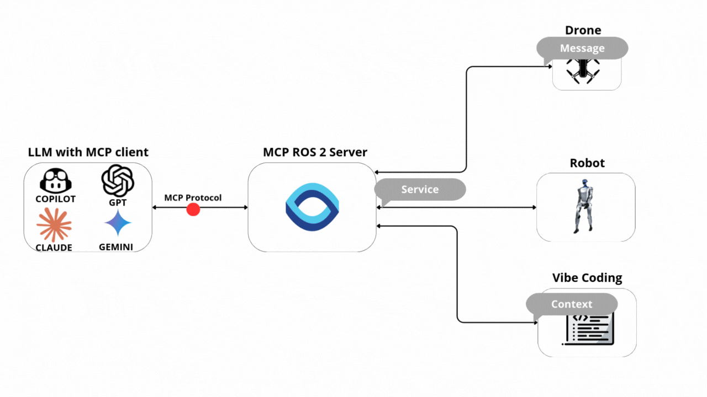

# WiseVision ROS2 MCP Server

[](https://discord.gg/9aSw6HbUaw)


[](https://hub.docker.com/mcp/server/ros2/overview)
[](https://app.easy.tools/ec/wisevision/wisevision-mcp-ros-2-pro)



A **Python** implementation of the **Model Context Protocol (MCP)** for **ROS2**. This server enables AI tooling to connect with **ROS2** nodes, topics, and services using the **MCP** standard over **stdio**. It is designed to be **the easiest** **ROS2** server to configure **in the world**.
## 🎯 Why Choose This MCP Server?

**Save hours of development time** with native AI integration for your ROS2 projects:

- **⚡ 1-minute setup** - World's easiest ROS2 MCP configuration
- **0️⃣ Zero-friction setup** - stdio transport, no brokers, no webserver.
- **🔌 Auto-discovery** - a built-in “list interfaces” tool dynamically enumerates available topics and services together with their message/service definitions (fields, types, schema) — so the client always knows exactly what data can be published or called. 
- **🤖 AI-powered debugging** - Let AI help you troubleshoot ROS2 issues in real-time
- **📊 Smart data analysis** - Query your robot's sensor data using natural language
- **🚀 Boost productivity** - Control robots, analyze logs, and debug issues through AI chat
- **💡 No ROS2 expertise required** - AI translates your requests into proper ROS2 commands

**Perfect for:** Robotics developers, researchers, students, and anyone working with ROS2 who wants to leverage AI for faster development and debugging.

🚀 **Enjoying this project?**  
You’re welcome to try the **Pro version** with extra features and priority support.  
👉 [Get Pro here](https://app.easy.tools/ec/wisevision/wisevision-mcp-ros-2-pro)


# 🌍 Real-world examples:


# ✨ Features
- List available topics 
- List available services 
- List available actions
- Call service
- Get messages from [WiseVision Data Black Box](https://github.com/wise-vision/wisevision_data_black_box) ([influxDB](https://www.influxdata.com) alternative to [Rosbag2](https://github.com/ros2/rosbag2))
- Subscribe topic to get messages
- Publish message on topic
- Echo message on topic
- Get fields from message type
- Send goal request to action
- Cancel action
- Send result request to action
- Subscribe action feedback
- Subscribe action status


**Note:** To call service with custom service source it before start server.


# ⚙️ Installation

Follow the [installation guide](installation/README.md) for step-by-step instructions:
- [🧩 Install in Visual Studio Code Copilot](installation/README.md#configure-visual-studio-code-copilot)
- [🤖 Install in Claude Desktop](installation/README.md#configure-claude-desktop)
- [💻 Install in Warp](installation/README.md#configure-warp)
- [🐳 Build Docker Image locally](installation/README.md#build-docker-image-locally)


### 🔧 ROS 2 Tools

#### 📋 **Topics**
| Tool | Description | Inputs | Outputs |
|------|-------------|--------|---------|
| **`ros2_topic_list`** | Returns list of available topics | – | `topic_name` (string): Topic name <br> `topic_type` (string): Message type |
| **`ros2_topic_subscribe`** | Subscribes to a ROS 2 topic and collects messages for a duration or message limit | `topic_name` (string) <br> `duration` (float) <br> `message_limit` (int) <br> *(defaults: first msg, 5s)* | `messages` <br> `count` <br> `duration` |
| **`ros2_get_messages`** | Retrieves past messages from a topic (data black box) | `topic_name` (string) <br> `message_type` (string) <br> `number_of_msg` (int) <br> `time_start` (str) <br> `time_end` (str) | `timestamps` <br> `messages` |
| **`ros2_get_message_fields`** | Gets field names and types for a message type | `message_type` (string) | Field names + types |
| **`ros2_topic_publish`** | Publishes message to a topic | `topic_name` (string) <br> `message_type` (string) <br> `data` (dict) | `status` |

---

#### 🛠 **Services**
| Tool | Description | Inputs | Outputs |
|------|-------------|--------|---------|
| **`ros2_service_list`** | Returns list of available services | – | `service_name` (string) <br> `service_type` (string) <br> `request_fields` (array) |
| **`ros2_service_call`** | Calls a ROS 2 service | `service_name` (string) <br> `service_type` (string) <br> `fields` (array) <br> `force_call` (bool, default: false) | `result` (string) <br> `error` (string, if any) |

#### 🎯 **Actions**
| Tool | Description | Inputs | Outputs |
|------|-------------|--------|---------|
| **`ros2_list_actions`** | Returns list of available ROS 2 actions with their types and request fields | – | `actions[]` (array) <br> └ `name` (string) <br> └ `types[]` (array of string) <br> └ `request_fields` (array) |
| **`ros2_send_action_goal`** | Sends a goal to an action. Optionally waits for the result. | `action_name` (string) <br> `action_type` (string) <br> `goal_fields` (object) <br> `wait_for_result` (bool, default: false) <br> `timeout_sec` (number, default: 60.0) | `accepted` (bool) <br> `goal_id` (string\|null) <br> `send_goal_stamp` (object\|null) <br> `waited` (bool) <br> `result_timeout_sec` (number\|null) <br> `status_code` (int\|null) <br> `status` (string\|null) <br> `result` (object\|null) \| `error` (string) |
| **`ros2_cancel_action_goal`** | Cancels a specific goal or all goals for an action | `action_name` (string) <br> `goal_id_hex` (string, required if `cancel_all`=false) <br> `cancel_all` (bool, default: false) <br> `stamp_sec` (int, default: 0) <br> `stamp_nanosec` (int, default: 0) <br> `wait_timeout_sec` (number, default: 3.0) | `service` (string) <br> `return_code` (int) <br> `return_code_text` (string) <br> `goals_canceling[]` (array of {`goal_id`, `stamp`}) \| `error` (string) |
| **`ros2_action_request_result`** | Waits for the RESULT of a given goal via GetResult | `action_name` (string) <br> `action_type` (string) <br> `goal_id_hex` (string, 32-char UUID) <br> `timeout_sec` (number\|null, default: 60.0) <br> `wait_for_service_sec` (number, default: 3.0) | `service` (string) <br> `goal_id` (string) <br> `waited` (bool) <br> `result_timeout_sec` (number\|null) <br> `status_code` (int\|null) <br> `status` (string\|null) <br> `result` (object\|null) \| `error` (string) |
| **`ros2_action_subscribe_feedback`** | Subscribes to feedback messages for an action. Can filter by goal_id. Collects messages for duration or max count. | `action_name` (string) <br> `action_type` (string) <br> `goal_id_hex` (string\|null) <br> `duration_sec` (number, default: 5.0) <br> `max_messages` (int, default: 100) | `topic` (string) <br> `action_type` (string) <br> `goal_id_filter` (string\|null) <br> `duration_sec` (number) <br> `messages[]` (array of {`goal_id`, `feedback`, `recv_stamp`}) \| `error` (string) |
| **`ros2_action_subscribe_status`** | Subscribes to an action's status topic and returns collected status frames | `action_name` (string) <br> `duration_sec` (number, default: 5.0) <br> `max_messages` (int, default: 100) | `topic` (string) <br> `duration_sec` (number) <br> `frames[]` (array of {`stamp`, `statuses[]`}) \| `error` (string) |


# 🐞 Debugging

Since MCP servers run over stdio, debugging can be challenging. For the best debugging
experience, we strongly recommend using the [MCP Inspector](https://github.com/modelcontextprotocol/inspector).

You can launch the MCP Inspector via [ `npm` ](https://docs.npmjs.com/downloading-and-installing-node-js-and-npm) with this command:

```bash
npx @modelcontextprotocol/inspector uv --directory /path/to/mcp_server_ros2 run mcp_ros_2_server
```

Upon launching, the Inspector will display a URL that you can access in your browser to begin debugging.
