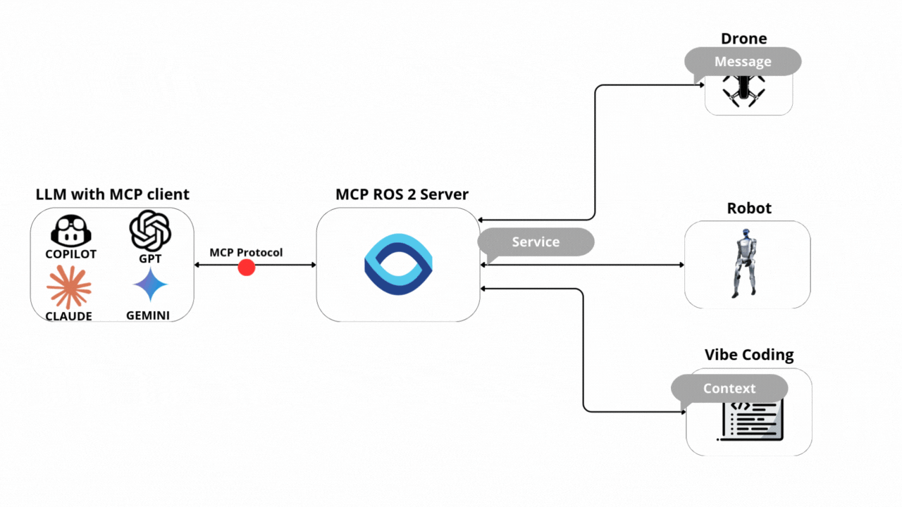

# ROS2 MCP Server

[](https://discord.gg/9aSw6HbUaw)


[](https://hub.docker.com/mcp/server/ros2/overview)
[](https://github.com/wise-vision/ros2_mcp/stargazers)



A **Python** implementation of the **Model Context Protocol (MCP)** for **ROS 2**. This server enables AI tooling to connect with **ROS 2** nodes, topics, and services using the **MCP** standard over **stdio**. Designed to be **the easiest** **ROS 2** MCP server to configure.

# ✨ Tools
- List available topics
- List available services
- Lists available actions with their types and request fields
- Call services
- Subscribe to topics to collect messages
- Publish messages to topics
- Echo messages on topics
- Get fields from message types
- Sends an action goal and optionally waits for the result
- Requests the result of an action goal
- Subscribes to feedback messages from an action
- Subscribes to status updates of an action
- Cancels a specific goal or all active goals
- Get messages from [WiseVision Data Black Box](https://github.com/wise-vision/wisevision_data_black_box) ([InfluxDB](https://www.influxdata.com) alternative to [Rosbag2](https://github.com/ros2/rosbag2))


# 🤖 Available Prompts
### 📘 Want to create a custom prompt? [Check the guide here](/docs/CREATE_PROMPT.md)

## 📊 base.ros2-topic-echo-and-analyze

Subscribe to a ROS2 topic, collect messages for a specified duration, and provide statistical analysis of the collected data.

➡️ Can auto-detect topic if only one is available. Analyzes message rates, counts, and statistics on numeric fields.

## 🔄 base.ros2-topic-relay

Subscribe to one ROS2 topic and republish messages to another topic with optional transformations.

➡️ Supports identity relay, rate limiting, and change-based filtering.

## 🏥 base.ros2-node-health-check

Check if expected ROS2 topics and services are available and functioning correctly with optional publication rate monitoring.

➡️ Provides comprehensive health report with status indicators and recommendations.

## 🔍 base.ros2-topic-diff-monitor

Compare two ROS2 topics and report differences in their messages with detailed field-by-field analysis.

➡️ Useful for comparing raw sensor data with filtered/processed versions or verifying topic synchronization.

## ROS2 MCP has Prompts extension with additional prompts [See here](https://github.com/wise-vision/ros2_mcp_prompts)


### 💡 Don’t know what prompts are? [See the MCP spec here](https://modelcontextprotocol.io/specification/2025-06-18/server/prompts#user-interaction-model).


**Note:** To call a service with a custom (non-default) type, source the package that defines it before starting the server.

## 🎯 Why Choose This MCP Server?

**Save hours of development time** with native AI integration for your ROS 2 projects:

## Why this ROS 2 MCP server ⭐

- **⚡ 1-minute setup** - World's easiest ROS 2 MCP configuration
- **0️⃣ Zero-friction setup** - stdio transport, no brokers, no webserver.
- **🔌 Auto type discovery** - a built-in “list interfaces” tool dynamically enumerates available topics and services together with their message/service definitions (fields, types, schema) — so the client always knows exactly what data can be published or called.
- **✨ Nested field support**: Handle complex message structures with ease.
- **🤖 AI-powered debugging** - Let AI help you troubleshoot ROS 2 issues in real time
- **📊 Smart data analysis** - Query your robot's sensor data using natural language
- **🚀 Boost productivity** - Control robots, analyze logs, and debug issues through AI chat
- **💡 No ROS 2 expertise required** - AI translates your requests into proper ROS 2 commands
- **🐋 Dockerized**: Ready-to-use Docker image for quick deployment.
- **🔧 Auto QoS selection**: Automatically selects appropriate Quality of Service settings for topics and services, ensuring optimal communication performance without manual configuration.

**Perfect for:** Robotics developers, researchers, students, and anyone working with ROS 2 who wants to leverage AI for faster development and debugging.

If you find this useful, please ⭐ star the repo — it helps others discover it.

🚀 **Enjoying this project?**
Feel free to contribute or reach out for support! Write issues, submit PRs, or join our [Discord community](https://discord.gg/9aSw6HbUaw) to connect with other ROS 2 and AI enthusiasts.

## 🏢 Commercial use and support

This project is free and MPL-2.0 licensed — you can use it in a commercial
product without asking anyone.

If you are putting it on a real machine and want more than the public issue
tracker, WiseVision (the maintainers) offer paid work around it:

- **Integration support** — getting the server running against your stack, your
  message types, your QoS constraints.
- **Custom tools and prompts** — handlers for your own interfaces, beyond the
  built-in topic/service/action set.
- **Priority fixes** — a defect that blocks your deployment, handled on a
  schedule instead of a backlog.

**Start here:
[Discussions → Q&A](https://github.com/wise-vision/ros2_mcp/discussions/categories/q-a).**
Open a thread describing your robot, your ROS 2 distro, and what you need; a
maintainer replies there. Public by default, which also means the next person
with your problem can read the answer. Nothing is auto-priced — tell us the
problem first.

Not commercial? Nothing changes: issues, PRs, and
[Discord](https://discord.gg/9aSw6HbUaw) stay open and free.

## 🤝 Contributing

Contributions are welcome! Please check the [open issues](https://github.com/wise-vision/ros2_mcp/issues) for
ways to help, open a pull request, or drop by our [Discord](https://discord.gg/9aSw6HbUaw) to discuss ideas
before diving in. By participating, you agree to follow our [Code of Conduct](CODE_OF_CONDUCT.md).

# 🚀 Drone Mission Using Prompts


# 🌍 Real-world examples:


# ⚙️ Installation

Follow the [installation guide](installation/README.md) for step-by-step instructions:
- [🧩 Install in Visual Studio Code Copilot](installation/README.md#configure-visual-studio-code-copilot)
- [🤖 Install in Claude Desktop](installation/README.md#configure-claude-desktop)
- [💻 Install in Warp](installation/README.md#configure-warp)
- [🐳 Build Docker Image locally](installation/README.md#build-docker-image-locally)

## 🧭 DDS discovery warm-up (Docker)

If the first tool call returns an incomplete list of topics/services right after container start, DDS discovery may still be in progress.
The server performs a one-time warm-up on the first tool call in container environments; tune it via:

- `MCP_ROS_DISCOVERY_STABLE_SEC` (default: `1.0`)
- `MCP_ROS_DISCOVERY_TIMEOUT_SEC` (default: `5.0`)
- `MCP_ROS_DISCOVERY_WARMUP=false` to disable

## 💡 Want to try it in simulation?
[Check out the Gazebo Drone Demo section](docs/DEMO_DRONE.md)


### 🔧 ROS 2 Tools

#### 📋 **Topics**
| Tool | Description | Inputs | Outputs |
|------|-------------|--------|---------|
| **`ros2_topic_list`** | Returns list of available topics | – | `topic_name` (string): Topic name <br> `topic_type` (string): Message type |
| **`ros2_topic_subscribe`** | Subscribes to a ROS 2 topic and collects messages for a duration or message limit | `topic_name` (string) <br> `duration` (float) <br> `message_limit` (int) <br> *(defaults: first msg, 5s)* | `messages` <br> `count` <br> `duration` |
| **`ros2_get_messages`** | Retrieves past messages from a topic (data black box) | `topic_name` (string) <br> `message_type` (string) <br> `number_of_messages` (int) <br> `time_start` (str) <br> `time_end` (str) | `timestamps` <br> `messages` |
| **`ros2_get_message_fields`** | Gets field names and types for a message type | `message_type` (string) | Field names + types |
| **`ros2_topic_publish`** | Publishes message to a topic | `topic_name` (string) <br> `message_type` (string) <br> `data` (dict) | `status` |

---

#### 🛠 **Services**
| Tool | Description | Inputs | Outputs |
|------|-------------|--------|---------|
| **`ros2_service_list`** | Returns list of available services | – | `service_name` (string) <br> `service_type` (string) <br> `request_fields` (array) |
| **`ros2_service_call`** | Calls a ROS 2 service | `service_name` (string) <br> `service_type` (string) <br> `fields` (array) <br> `force_call` (bool, default: false) | `result` (string) <br> `error` (string, if any) |

#### 🎯 **Actions**
| Tool | Description | Inputs | Outputs |
|------|-------------|--------|---------|
| **`ros2_list_actions`** | Returns list of available ROS 2 actions with their types and request fields | – | `actions[]` (array) <br> └ `name` (string) <br> └ `types[]` (array of string) <br> └ `request_fields` (array) |
| **`ros2_send_action_goal`** | Sends a goal to an action. Optionally waits for the result. | `action_name` (string) <br> `action_type` (string) <br> `goal_fields` (object) <br> `wait_for_result` (bool, default: false) <br> `timeout_sec` (number, default: 60.0) | `accepted` (bool) <br> `goal_id` (string\|null) <br> `send_goal_stamp` (object\|null) <br> `waited` (bool) <br> `result_timeout_sec` (number\|null) <br> `status_code` (int\|null) <br> `status` (string\|null) <br> `result` (object\|null) \| `error` (string) |
| **`ros2_cancel_action_goal`** | Cancels a specific goal or all goals for an action | `action_name` (string) <br> `goal_id_hex` (string, required if `cancel_all`=false) <br> `cancel_all` (bool, default: false) <br> `stamp_sec` (int, default: 0) <br> `stamp_nanosec` (int, default: 0) <br> `wait_timeout_sec` (number, default: 3.0) | `service` (string) <br> `return_code` (int) <br> `return_code_text` (string) <br> `goals_canceling[]` (array of {`goal_id`, `stamp`}) \| `error` (string) |
| **`ros2_action_request_result`** | Waits for the RESULT of a given goal via GetResult | `action_name` (string) <br> `action_type` (string) <br> `goal_id_hex` (string, 32-char UUID) <br> `timeout_sec` (number\|null, default: 60.0) <br> `wait_for_service_sec` (number, default: 3.0) | `service` (string) <br> `goal_id` (string) <br> `waited` (bool) <br> `result_timeout_sec` (number\|null) <br> `status_code` (int\|null) <br> `status` (string\|null) <br> `result` (object\|null) \| `error` (string) |
| **`ros2_action_subscribe_feedback`** | Subscribes to feedback messages for an action. Can filter by goal_id. Collects messages for duration or max count. | `action_name` (string) <br> `action_type` (string) <br> `goal_id_hex` (string\|null) <br> `duration_sec` (number, default: 5.0) <br> `max_messages` (int, default: 100) | `topic` (string) <br> `action_type` (string) <br> `goal_id_filter` (string\|null) <br> `duration_sec` (number) <br> `messages[]` (array of {`goal_id`, `feedback`, `recv_stamp`}) \| `error` (string) |
| **`ros2_action_subscribe_status`** | Subscribes to an action's status topic and returns collected status frames | `action_name` (string) <br> `duration_sec` (number, default: 5.0) <br> `max_messages` (int, default: 100) | `topic` (string) <br> `duration_sec` (number) <br> `frames[]` (array of {`stamp`, `statuses[]`}) \| `error` (string) |


# 🐞 Debugging

Since MCP servers run over stdio, debugging can be challenging. For the best debugging
experience, we strongly recommend using the [MCP Inspector](https://github.com/modelcontextprotocol/inspector).

You can launch the MCP Inspector via [ `npm` ](https://docs.npmjs.com/downloading-and-installing-node-js-and-npm) with this command:

```bash
npx @modelcontextprotocol/inspector uv --directory /path/to/ros2_mcp run mcp_ros_2_server
```

Upon launching, the Inspector will display a URL that you can access in your browser to begin debugging.

## 📚 Origins and evolution

We built this server to make AI‑assisted ROS 2 development fast and reliable. Internally, we needed a simple way for agents to discover message types, publish/subscribe to topics, and call services—without boilerplate or flaky networking. That led to a few core design goals:
- Handle all ROS 2 message types (including nested fields) so agents can write and test any code
- Integrate topic pub/sub and service calls to validate behavior end‑to‑end
- Work seamlessly with GitHub Copilot in VS Code and other MCP clients
- Use a simple stdio transport to avoid network complexity

After dogfooding it, we open‑sourced the project to help the broader ROS 2 community build faster with AI. It’s now useful not only for development, but also for controlling robots, running QoS experiments, and analyzing live data and robot/swarm state. The project is actively maintained—features and improvements ship regularly based on user feedback. If this project helps you, please star the repo and share your use case!
