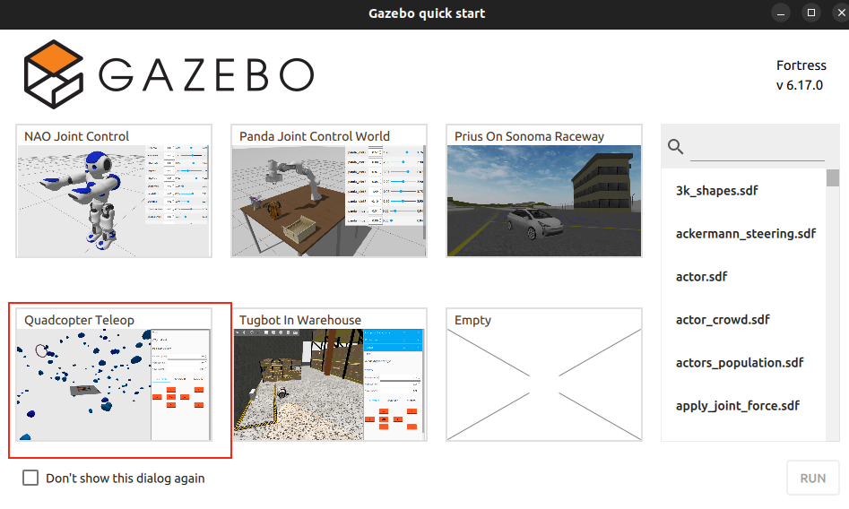
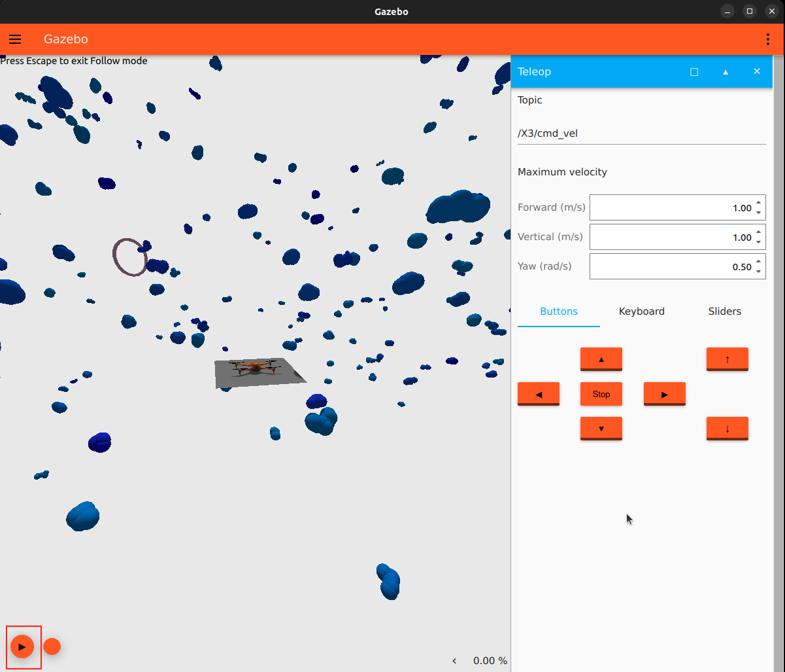

# Demo: Drone Simulation with Gazebo

## Prerequisites

- [ROS2 Humble installed](https://docs.ros.org/en/humble/Installation.html) or later
- [Gazebo installed](https://gazebosim.org/docs/fortress/install/)
- Gazbeo ROS2 Bridge installed:
    ```bash
    sudo apt install ros-humble-ros-gz-bridge \
                    ros-humble-ros-gz-sim \
                    ros-humble-ros-gz-image \
                    ros-humble-ros-gz-interfaces
    ```

## Instrcution 
1. Launch Gazebo:
    ```bash
    ign gazebo
    ```
2. Select the `Quadcopter Teleop` world.


3. `Start the simulation` by clicking the `Play` button.



4. In a `second terminal`, start the `ROS–Gazebo` bridge:
    ```bash
    ros2 run ros_gz_bridge parameter_bridge \
        /X3/cmd_vel@geometry_msgs/msg/Twist@ignition.msgs.Twist \
        /clock@rosgraph_msgs/msg/Clock@ignition.msgs.Clock \
        /world/quadcopter_teleop/clock@rosgraph_msgs/msg/Clock@ignition.msgs.Clock \
        /world/quadcopter_teleop/pose/info@tf2_msgs/msg/TFMessage@ignition.msgs.Pose_V
    ```
5. `Interact` with the `simulation` using `ROS 2 MCP`.

    Ask the `Agent` to perform an action — the `MCP` will execute it in the simulation. 
    
    For example: “Fly the drone up by one meter. Using ROS2 MCP”
