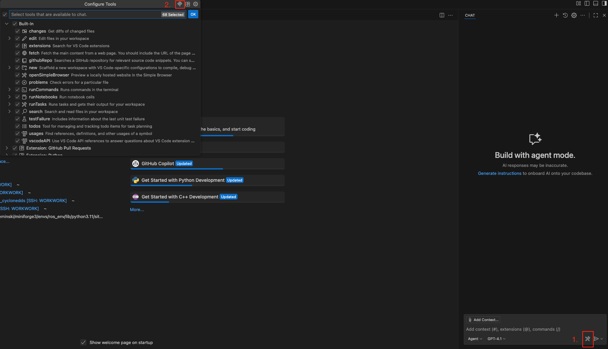
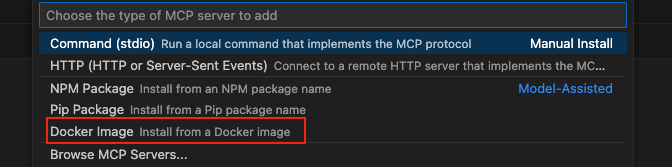
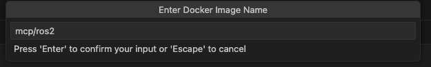
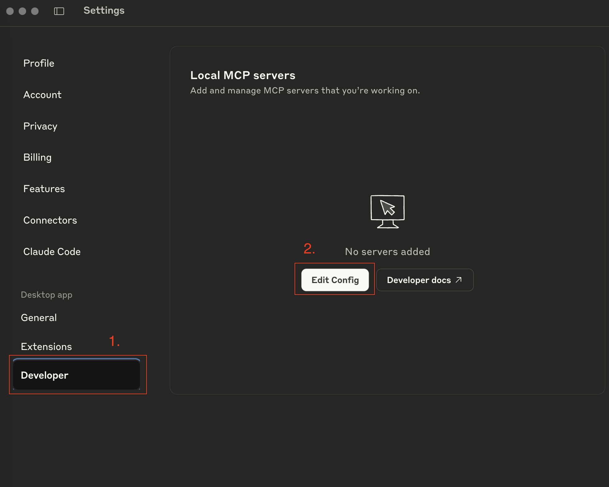
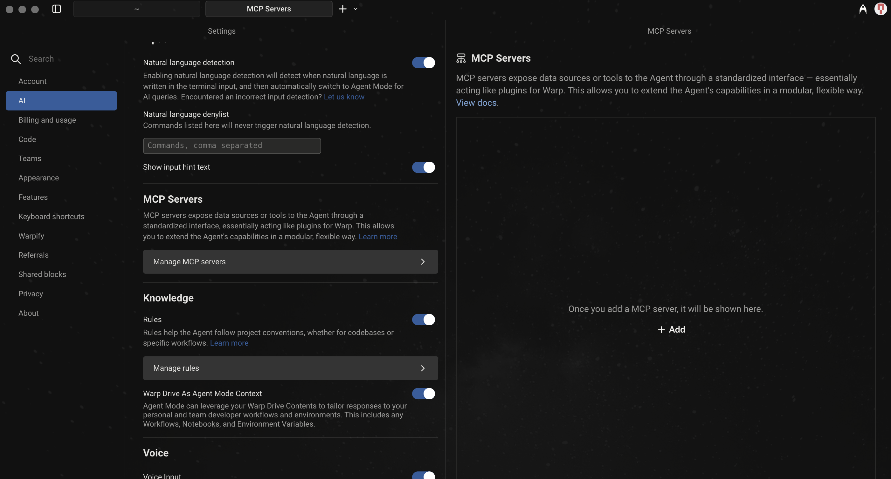

# Installation guide

## Configure Visual Studio Code Copilot

This tutorial will guide you through the process of configuring Visual Studio Code Copilot, an AI-powered code completion tool for developers. Copilot integrates seamlessly with VS Code to provide intelligent code suggestions, accelerate development, and improve productivity across multiple programming languages.

### Prerequisites

Before you begin, ensure you have the following:
- ⁠ROS 2 installed on your system (humble or later). [Get ROS 2](https://docs.ros.org/en/humble/Installation.html)
- ⁠Docker installed and running. [Get Docker](https://docs.docker.com/get-docker/)
- ⁠Visual Studio Code installed. [Get Visual Studio Code](https://code.visualstudio.com/Download)

### Step 1: Install ROS2 MCP

1. Click on the `tools` icon
2. Click on the `MCP` icon


3. Choose type of the MCP server as `Docker Image`



4. Enter the name of the image `mcp/ros2`



## Configure Claude Desktop

This tutorial will guide you through the process of configuring Claude Desktop, a modern AI assistant available on Windows and macOS. Claude provides natural language interaction, context-aware reasoning, and productivity tools designed to streamline your workflow and enhance creativity directly from your desktop.

### Prerequisites

Before you begin, ensure you have the following:
- ⁠ROS 2 installed on your system (humble or later). [Get ROS 2](https://docs.ros.org/en/humble/Installation.html)
- ⁠Docker installed and running. [Get Docker](https://docs.docker.com/get-docker/)
- Claude Desktop installed. [Get Claude Desktop](https://claude.ai/download)

### Step 1: Install ROS2 MCP
1. ⁠Open `Claude` and navigate to the settings.
2. ⁠In the settings menu, select ⁠ `Developer ⁠ from the sidebar.
3. Click on the `Edit config` in `local MCP servers`.


4. Paste it into config:
```json
{
  "ros2_mcp": {
    "command": "docker",
    "args": [
      "run",
      "-i",
      "--rm",
      "wisevision/ros2_mcp:<humble/jazzy>"
    ],
    "env": {},
    "working_directory": null,
    "start_on_launch": true
  }
}
```
To use custom messages [create folder](#add-custom-messages) and paste it into config:
```json
{
  "ros2_mcp": {
    "command": "docker",
    "args": [
      "run",
      "-i",
      "--rm",
      "-v", "~/mcp_custom_messages:/app/custom_msgs"
      "wisevision/ros2_mcp:<humble/jazzy>"
    ],
    "env": {},
    "working_directory": null,
    "start_on_launch": true
  }
}
```
To use custom prompts:
```json
{
  "mcp_server_ros_2": {
    "command": "docker",
    "args": [
      "run",
      "-i",
      "--rm",
      "-e", "MCP_CUSTOM_PROMPTS=true",
      "wisevision/mcp_server_ros_2:<humble/jazzy>"
    ],
    "env": {},
    "working_directory": null,
    "start_on_launch": true
  }
}
```
To use custom prompts from local folder:
```json
{
  "mcp_server_ros_2": {
    "command": "docker",
    "args": [
      "run",
      "-i",
      "--rm",
      "-e", "MCP_CUSTOM_PROMPTS=true",
      "-e", "MCP_PROMPTS_LOCAL=true",
      "-v", "<path_to_folder>/ros2_mcp_prompts:/app/ros2_mcp_prompts"
      "wisevision/mcp_server_ros_2:<humble/jazzy>"
    ],
    "env": {},
    "working_directory": null,
    "start_on_launch": true
  }
}
```
### Step 2: Save and Enjoy

After saving you should see indicator that the MCP server is running.

## Configure WARP

This tutorial will guide you through the process of configuring WARP, a modern terminal emulator for Windows, macOS, and Linux. WARP offers a sleek interface and powerful features that enhance your command-line experience including MCP support.

### Prerequisites

Before you begin, ensure you have the following:
- ⁠ROS 2 installed on your system (humble or later). [Get ROS 2](https://docs.ros.org/en/humble/Installation.html)
- ⁠Docker installed and running. [Get Docker](https://docs.docker.com/get-docker/)
- ⁠WARP installed. [Get WARP](https://www.warp.dev/)

### Step 1: Install ROS2 MCP

Install by cloning the repository and building the package.

```bash
git clone https://github.com/wise-vision/ros2_mcp.git
cd ros2_mcp
docker build -t wisevision/ros2_mcp .
```


### Step 2: Configure WARP

1. ⁠Open WARP and navigate to the settings by clicking on the gear icon in the bottom left corner.
2. ⁠In the settings menu, select ⁠ AI ⁠ from the sidebar.
3. ⁠Scroll down to the ⁠ MCP Servers ⁠ section.
4. ⁠Click on ⁠ Add ⁠ to create a new server configuration.




### Step 3: Add MCP Server

```json
{
  "ros2_mcp": {
    "command": "docker",
    "args": [
      "run",
      "-i",
      "--rm",
      "wisevision/ros2_mcp:<humble/jazzy>"
    ],
    "env": {},
    "working_directory": null,
    "start_on_launch": true
  }
}
```
To use custom messages [create folder](#add-custom-messages) and paste it into config:
```json
{
  "ros2_mcp": {
    "command": "docker",
    "args": [
      "run",
      "-i",
      "--rm",
      "-v", "~/mcp_custom_messages:/app/custom_msgs"
      "wisevision/ros2_mcp:<humble/jazzy>"
    ],
    "env": {},
    "working_directory": null,
    "start_on_launch": true
  }
}
```
To use custom prompts:
```json
{
  "mcp_server_ros_2": {
    "command": "docker",
    "args": [
      "run",
      "-i",
      "--rm",
      "-e", "MCP_CUSTOM_PROMPTS=true",
      "wisevision/mcp_server_ros_2:<humble/jazzy>"
    ],
    "env": {},
    "working_directory": null,
    "start_on_launch": true
  }
}
```
To use custom prompts from local folder:
```json
{
  "mcp_server_ros_2": {
    "command": "docker",
    "args": [
      "run",
      "-i",
      "--rm",
      "-e", "MCP_CUSTOM_PROMPTS=true",
      "-e", "MCP_PROMPTS_LOCAL=true",
      "-v", "<path_to_folder>/ros2_mcp_prompts:/app/ros2_mcp_prompts"
      "wisevision/mcp_server_ros_2:<humble/jazzy>"
    ],
    "env": {},
    "working_directory": null,
    "start_on_launch": true
  }
}
```

### Step 4: Save and Enjoy

After saving you should see indicator that the MCP server is running. You can now test the setup by using the AI features in WARP.

# Build docker image locally:
```bash
git clone https://github.com/wise-vision/ros2_mcp.git
cd ros2_mcp
docker build -t ros2_mcp:<humble/jazzy>  --build-arg ROS_DISTRO=<humble/jazzy> .
```

---

### Thanks for using our MCP server for ROS 2! Good luck with your projects!
---

## Add custom messages
### Create folder for custom messages
```bash
mkdir -p ~/mcp_custom_messages/src
```
### Add messages packages to `src` in `mcp_custom_messages`
```bash
cd ~/mcp_custom_messages/src
git clone https://github.com/ros/ros_tutorials.git #or your custom message pack
```
### Build
```bash
cd ~/mcp_custom_messages
colcon build
```